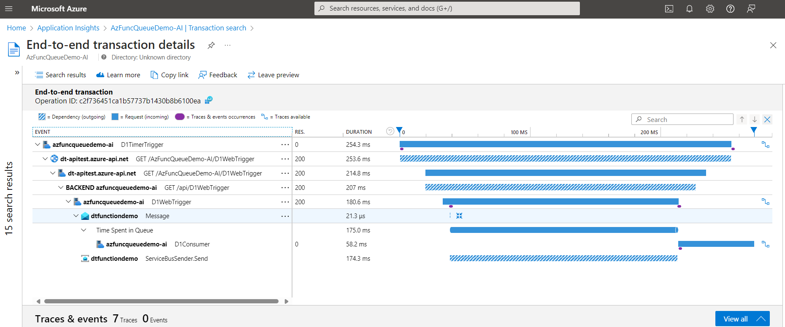
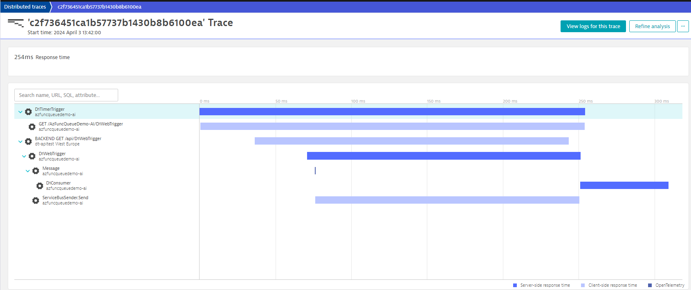

# Application Insights Exporter for OpenTelemetry

The Application Insights Exporter allows to read traces exported from Azure Application Insights and send it to an OpenTelemetry OTLP compatible endpoint. 

## How does it work?
The project comes with an Azure Function, bound to an EventHub from which it receives and then converts and forwards the telemetry. 

Supported [Application Insights telemetry types](https://learn.microsoft.com/en-us/azure/azure-monitor/app/data-model) are: 
* AppDependency
* AppRequests

Supported OpenTelemetry formats are: 
* [OTLP/HTTP binary format](https://opentelemetry.io/docs/reference/specification/protocol/otlp/#binary-protobuf-encoding)

## Getting Started

The project contains 2 Azure Functions targeting different deployment models: 
* ApplicationInsightsForwarderWorker  (.NET 8 isolated worker)
* ApplicationInsightsForwarder (.NET 6 in-process)[^1]

[^1]: It is recommended to use the ApplicationInsightsForwarderWorker function using the isolated worker model as recommended by Microsoft [here](https://techcommunity.microsoft.com/t5/apps-on-azure-blog/net-on-azure-functions-march-2024-roadmap-update/ba-p/4097744).  

### Pre-Requisites
* Create or configure an Azure EventHub to which you want to forward the telemetry from your Application Insights instance. 
* If your target backend doesn't support OLTP/HTTP binary format, you can use an [OpenTelemetry Collector](https://opentelemetry.io/docs/collector/) as a receiving endpoint for the Azure Function. 

### Sending trace telemetry to EventHub
Configure Diagnostic settings of your Application Insights instance from which you want to forward the telemtry. 
* Check **Dependencies** and **Requests**  in the telemetry catgories (all other categories will be ignored when processing) 
* Check the **Stream to an event hub** and select your previously configured eventhub. 


### Running the forwarder locally
1. Configure **local.settings.json** 

```
/* SAMPLE SETTINGS FILE FOR ISOLATED-WORKER DEPLOYMENT MODEL*/
{
  "IsEncrypted": false,
  "Values": {
    "AzureWebJobsStorage": "UseDevelopmentStorage=true",
    "FUNCTIONS_WORKER_RUNTIME": "dotnet-isolated",
    "EHConnection": "<YourEventHubConnectionString",
    "OTLP_ENDPOINT": "http://localhost:4318/v1/traces"
    /*,"OTLP_HEADER_AUTHORIZATION": "Api-Token XXXXX"*/
  }
}
```
* Replace the value of **EHConnection** with the connection string to read from your configured eventhub. Read more about here, [how to get an Event Hub connection string](https://learn.microsoft.com/en-us/azure/event-hubs/event-hubs-get-connection-string). Make sure your connection string contains the configured EventHub name, provided via the additional component `EntityPath` which should look like this: `Endpoint=sb://<NamespaceName>.servicebus.windows.net/;SharedAccessKeyName=Listen;SharedAccessKey=<KeyName>;EntityPath=<EventHubName>`. 
* Configure the **OTLP_ENDPOINT* to point to your targeted OLTP/HTTP binary compatible endpoint. By default it's a local endpoint configured for testing. 
* Optionally configure **OTLP_HEADER_AUTHORIZATION**. If your OTLP endpoint requires authentication, you can set the **Authorization** http-header with this setting. 

2. Run your Function

For more details how to run an Azure Function locally see [Code and test Azure Functions locally](https://learn.microsoft.com/en-us/azure/azure-functions/functions-develop-local)

### Deploy the Function to Azure using the GitHub action
The project comes with a GitHub action to deploy the project directly to an existing Azure Function from GitHub. 

**Note:** To be able to deploy to Azure from GitHub, make sure your Azure Function has configured the app setting `WEBSITE_RUN_FROM_PACKAGE = 1`. See also [here](https://learn.microsoft.com/en-us/azure/app-service/deploy-run-package#enable-running-from-package)

#### Step 1) Fork the project into your github repostiory 
For more information how to fork a repository, see here: [Fork a repository - GitHub-Dokumentation](https://docs.github.com/de/pull-requests/collaborating-with-pull-requests/working-with-forks/fork-a-repo)

#### Step 2) Download publishing profile from your Azure Function 
To download the publishing profile of your function app:

   * Select the function app's **Overview** page, and then select **Get publish profile**.

For more information how to get the publising profile, see here: [Get a publish profile from Azure App Service - Microsoft Learn](https://learn.microsoft.com/en-us/visualstudio/azure/how-to-get-publish-profile-from-azure-app-service?view=vs-2022)

#### Step 3) Add the GitHub secret and variables
  *	Go to **Settings**.
  *	Select **Secrets and variables > Actions**.
  *	Select **New repository secret**.
  *	Add a new secret with the name `AZURE_FUNCTIONAPP_PUBLISH_PROFILE` and the value set to the contents of the publishing profile file.
  *	Select **Add secret**.

GitHub can now authenticate to your function app in Azure.
  * Select **New repository variable**.
  * Add a new variable with the name `AZURE_FUNCTIONAPP_NAME` and the value set to the name of your Azure Function.
  * Select **Add variable**.

The GitHub action now has all necessary details to deploy the function code to your Azure Function.

#### Step 4) Trigger the GitHub action to deploy to Azure
The workflow is configured to be manually triggered.
  * In GitHub, go to your forked repository.
  * Go to **Actions**.
  * Select the workflow **Deploy ApplicationInsightsForwarderWorker** or **Deploy ApplicationInsightsForwarder**.
  * Select **Run workflow**


### [Optional] Run an OpenTelemetry Collector 
The project contains a collector config **otel_collector_config.yaml**, configured with a pipeline for an OTLP/HTTP format requiring an authorization token. It allows to pass the receiving OTLP endpiont and an authorization token via environment variables. 
```
receivers:
  otlp:
    protocols:
      http:
exporters:
  otlphttp:
    endpoint: "${OTLPHTTP_ENDPOINT}"
    headers: {"Authorization": "Api-Token ${API_TOKEN}"}
service:
  pipelines:
    traces:
      receivers: [otlp]
      processors: []
      exporters: [otlphttp]
```

Now run the standard OpenTelemetry collector image from Docker-Hub [otel/opentelemetry-collector-contrib](https://hub.docker.com/r/otel/opentelemetry-collector-contrib), dynamically passing over necessary configuration.

Windows
```
docker run -p 4318:4318  -e OTLPHTTP_ENDPOINT="<Your-receiving-OTLP-endpoint>" -e API_TOKEN="<Your-api-token>" -v %cd%/otel_collector_config.yaml:/etc/otelcol-contrib/config.yaml otel/opentelemetry-collector-contrib
```

Linux
```
docker run -p 4318:4318  -e OTLPHTTP_ENDPOINT="<Your-receiving-OTLP-endpoint>" -e API_TOKEN="<Your-api-token>" -v $(pwd)/otel_collector_config.yaml:/etc/otelcol-contrib/config.yaml otel/opentelemetry-collector-contrib
```

**Note**: Replace *&lt;Your-receiving-OTLP-endpoint&gt;* and *&lt;Your-api-token&gt;* with the values matching your trace backend's configuration

### Original Trace in Application Insights


### Exported Trace in Dynatrace


## Release Notes
* v0.1.0 - Initial release supporting AppDependency, AppRequests mapped and forwarded to OTLP/HTTP JSON
* v0.9.0 - Swichting from OTLP/HTTP json format to OTLP/HTTP binary format. 
* v1.0.0 - Updating attribute mapping to better fit OpenTelemetry semantic conventions. Added a new forwarder function based on .NET 8 isolated worker model. 

## Contribute
This is an open source project, and we gladly accept new contributions and contributors.  

## License
Licensed under Apache 2.0 license. See [LICENSE](LICENSE) for details.

